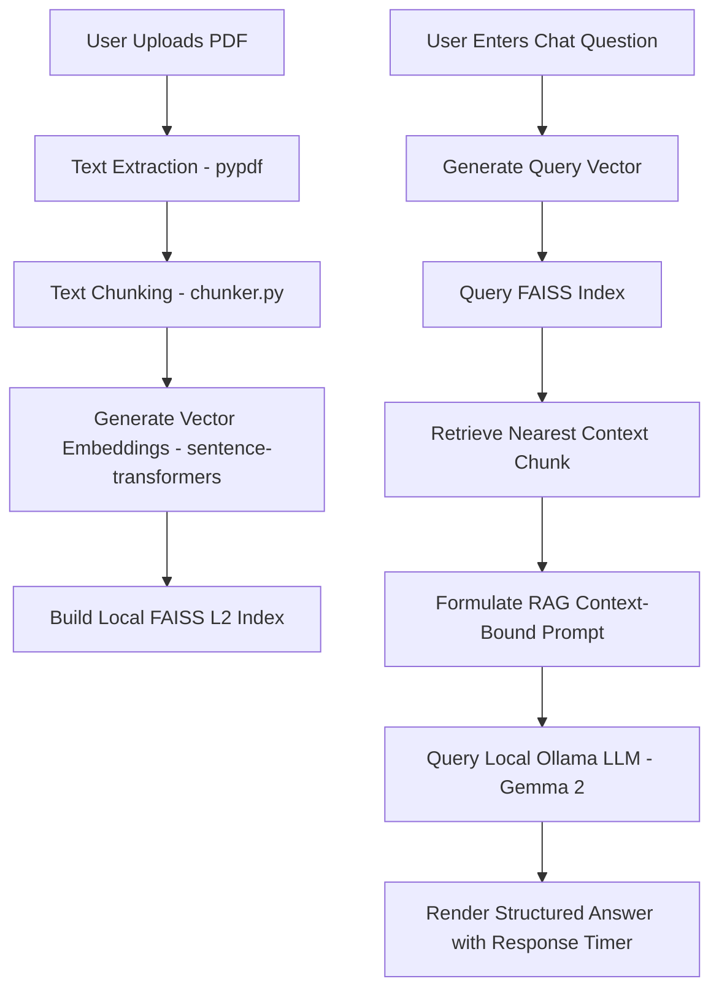

# 📚 PDF AI Assistant - Local RAG System

[](https://www.python.org/)
[](https://streamlit.io/)
[](https://ollama.com/)
[](https://github.com/facebookresearch/faiss)

A high-performance, private, local Retrieval-Augmented Generation (RAG) system that allows you to upload any PDF document and ask natural language questions. It processes everything on your local machine using SentenceTransformers for embeddings, FAISS for similarity search, and Ollama (Gemma 2) for response generation.

---

## 📌 Project Features

- **🔒 100% Local & Private**: No data leaves your machine. Your PDFs and query history remain secure.
- **⚡ High-Performance Retrieval**: Utilizes Facebook AI Similarity Search (FAISS) for sub-millisecond semantic search retrieval.
- **📖 Flexible PDF Ingestion**: Extracts text using `pypdf`, chunking long documents to capture deep contextual information.
- **💬 Interactive Chat Interface**: Intuitive Streamlit UI with response timer and model processing metrics.
- **🧠 Configurable Local Models**: Run any local LLM (e.g. `gemma2:2b`, `llama3`) and embedding model supported by SentenceTransformers via a standard environment configuration.

---

## 📂 Project Structure

```text
pdf_qa_system/
├── .env.example                 # Example template for environment configuration
├── .gitignore                   # Comprehensive Python & Streamlit environment ignores
├── README.md                    # System documentation and setup guides
├── app.py                       # Main Streamlit web application entrypoint
├── requirements.txt             # Primary Python package dependencies
├── data/                        # Local file buffer (ignored by Git, stores uploaded PDFs)
│   └── .gitkeep                 # Placeholder to track data directory in Git
├── scripts/                     # Helper utilities and validation scripts
│   └── FAISS_search_setup.py    # Test script to verify FAISS installation
├── src/                         # Core logic package
│   ├── __init__.py              # Package initializer
│   ├── config.py                # Environment-aware configuration loader
│   ├── chunker.py               # Text segmentation logic for context building
│   ├── embedding.py             # Vector embedding generation (SentenceTransformers)
│   ├── pdf_loader.py            # PDF document parser and text extractor
│   └── query_system.py          # FAISS semantic search and Ollama inference pipeline
└── tests/                       # Unit tests suite
    ├── __init__.py              # Test package initializer
    ├── test_chunker.py          # Test suite for chunker logic
    └── test_pdf_loader.py       # Mocked test suite for PDF parser
```

---

## ⚙️ System Architecture Flow



---

## 🚀 Installation & Local Setup

### 1. Prerequisites
- **Python 3.8** or newer installed.
- **Ollama** installed on your system. Download it from [ollama.com](https://ollama.com).

### 2. Download and Run Ollama Model
Start the Ollama daemon and pull the configured model:
```bash
ollama run gemma2:2b
```

### 3. Clone and Setup Environment
Navigate to the project root and create a Python virtual environment:

#### Windows (PowerShell/CMD):
```powershell
python -m venv venv
venv\Scripts\activate
```

#### macOS / Linux:
```bash
python3 -m venv venv
source venv/bin/activate
```

### 4. Configure Environment Variables
Copy the template `.env.example` to `.env` and adjust settings as necessary:
```bash
cp .env.example .env
```
Default options inside `.env`:
```env
OLLAMA_MODEL=gemma2:2b
EMBEDDING_MODEL=all-MiniLM-L6-v2
```

### 5. Install Dependencies
Install all required libraries specified in the `requirements.txt`:
```bash
pip install -r requirements.txt
```

---

## ▶️ Running the Application

To start the Streamlit local server, execute:
```bash
streamlit run app.py
```

The application will launch and open in your default browser at **`http://localhost:8501`**.

---

## 🧪 Running Unit Tests

This project includes a suite of unit tests located in the `tests/` directory to ensure functionality of core modules. Run tests using Python's built-in `unittest` framework:

```bash
python -m unittest discover -s tests
```

---

## 🔧 Core Component Details

- **`src/config.py`**: Reads variables from the `.env` file for dynamic model loading.
- **`src/embedding.py`**: Generates high-quality sentence embeddings using SentenceTransformers.
- **`src/query_system.py`**: Restricts the assistant to source PDF data and avoids hallucinations.

---

## 📜 License
This project is licensed under the MIT License.

